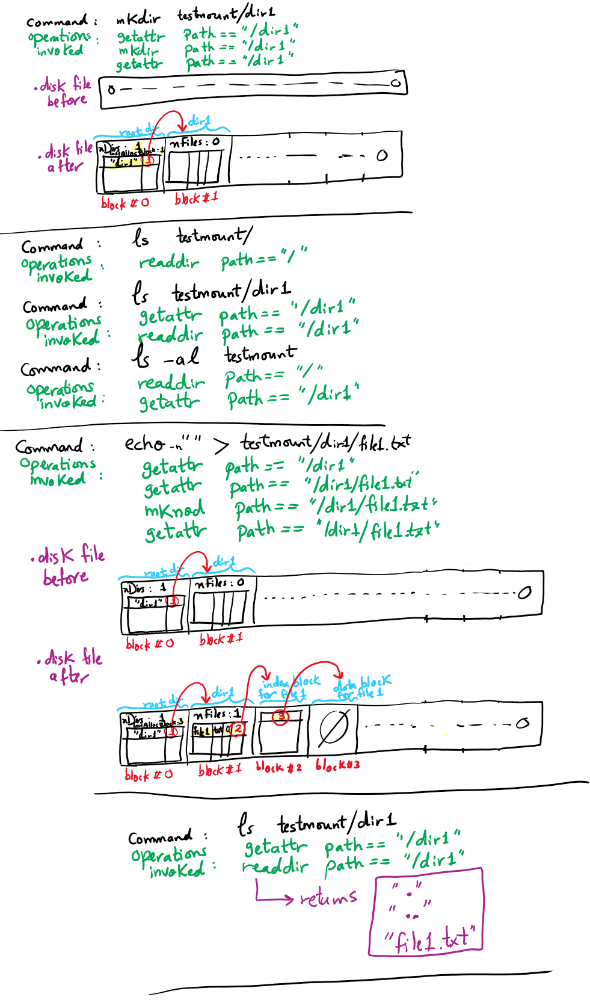
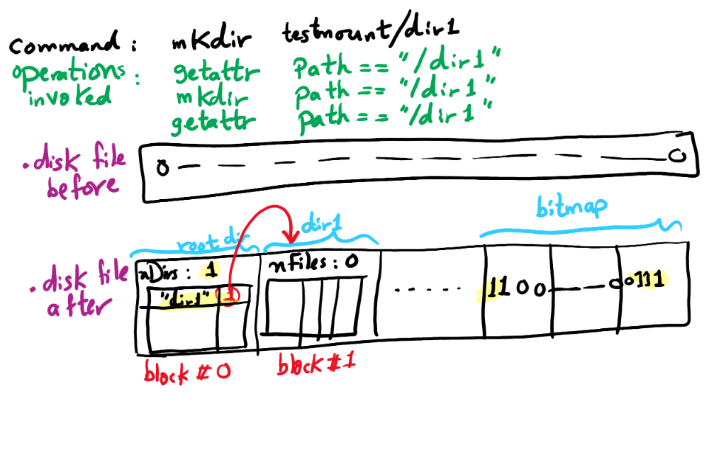
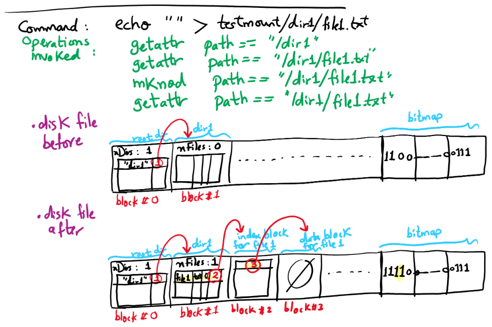
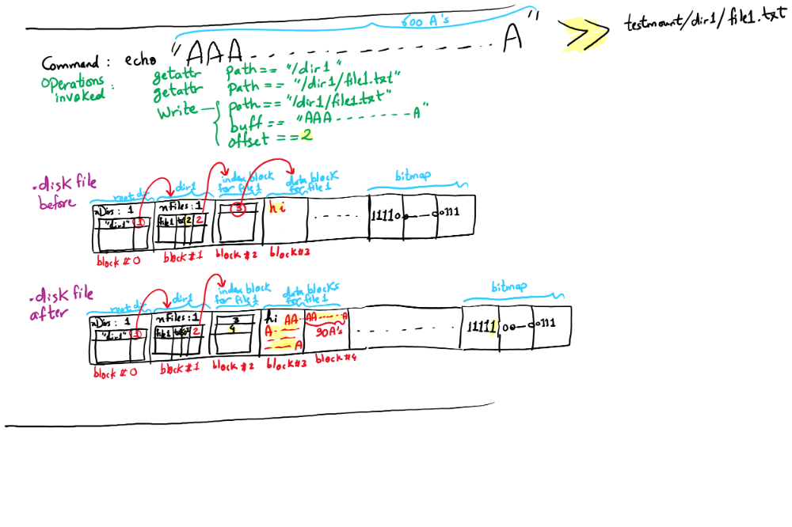

Project 4: Filesystems
======================
(_Based upon Project 4 of Dr. Misurda's CS 1550 course._)

To submit your project code, submit your GitHub Classroom repository to Gradescope. __Only the following files will be used for grading__:
- `cs1550.c`

- Due date: Saturday 8/7/2021 at 11:59 pm (EDT)
- Late due date: Monday 8/9/2021 at 11:59 pm (EDT)
- 
---

[FUSE](https://www.kernel.org/doc/html/latest/filesystems/fuse.html) is a Linux kernel extension that allows for a userspace program to provide the implementations for the various file-related syscalls. We will be using FUSE to create our own filesystem, managed via a single file that represents our disk device. Through FUSE and our implementation, it will be possible to interact with our newly created filesystem using standard UNIX/Linux programs in a transparent way.

From an interface perspective, our filesystem will be a two-level directory system, with the following restrictions/simplifications:

1. The root directory `/` will only contain other subdirectories, and no regular files.
2. The subdirectories will only contain regular files, and no subdirectories of their own.
3. All files will be full access (i.e., `chmod 0666`), with permissions to be mainly ignored.
4. Many file attributes such as creation and modification times will not be accurately stored.

From an implementation perspective, the filesystem will keep data on "disk" via an indexed allocation strategy, outlined below.

## Project overview

Your job is to create the cs1550 filesystem as a FUSE application that provides the interface described above. A code skeleton has been provided for you to fill out; you will only need to modify cs1550.c.

It is automatically built when you type `make`. The cs1550 filesystem should be implemented using a single file named `.disk` (created by `make .disk`, or when you debug the program; see below) and managed by the real filesystem in the directory that contains the cs1550 application. This file should keep track of the directories and the file data. We will consider the disk to have 512-byte blocks.

## Disk management

In order to manage the free (or empty) space, you will need to create bookkeeping data in `.disk` that records the last block number that was allocated. (Please note that this is an overly simplistic way of keeping track of free blocks. In general, a scheme such as a block bitmap or a linked list of free blocks is needed.)

To recreate your 5MB `.disk` image from scratch, execute the following:

- `make clean`
- `make .disk`

This will create a file initialized to contain all zeros, named `.disk`. You only need to do this once, or every time you want to completely destroy the disk. (This is our "format" command.)

## Root directory

Since the disk contains blocks that are directories and blocks that are file data, we need to be able to find and identify what a particular block represents. In our file system, the root only contains other directories, so we will use block 0 of `.disk` to hold the directory entry of the root, and from there, find our subdirectories.

The root directory entry will be a struct defined as below:

```c
struct cs1550_directory {
	/* Directory name, plus extra space for the null terminator */
	char dname[MAX_FILENAME + 1];

	/* Block number of the directory block in the `.disk` file */
	size_t n_start_block;
};

struct cs1550_root_directory {
	/* Block number of the last block that was allocated */
	size_t last_allocated_block;

	/* Number of subdirectories under the root */
	size_t num_directories;

	/* All subdirectories of the root */
	struct cs1550_directory directories[MAX_DIRS_IN_ROOT];

	/* Padding so the entry is one block large. Don't use this field. */
	char __padding[ROOT_PADDING];
};
```

Since we are limiting our root to be one block in size, there is a limit on how many subdirectories we can create, `MAX_DIRS_IN_ROOT`. Each subdirectory will have an entry in the directories array with its name and the block index of the subdirectory's directory entry.

## Subdirectories

Directories will be stored in our `.disk` file as a single block-sized `cs1550_directory_entry` structure per subdirectory. The structure is defined below:

```c
struct cs1550_file_entry {
	/* File name, plus extra space for the null terminator */
	char fname[MAX_FILENAME + 1];

	/* File extension, plus extra space for the null terminator */
	char fext[MAX_EXTENSION + 1];

	/* Size of the file, in bytes */
	size_t fsize;

	/* Block number of the file's index block in the `.disk` file */
	size_t n_index_block;
};

struct cs1550_directory_entry {
	/* Number of files in directory. Must be less than MAX_FILES_IN_DIR */
	size_t num_files;

	/* The actual files */
	struct cs1550_file_entry files[MAX_FILES_IN_DIR];

	/* Padding so the entry is one block large. Don't use this field. */
	char __padding[DIRECTORY_PADDING];
};
```

Since we require each directory entry to only take up a single disk block, we are limited to a fixed number of files per directory. Each file entry in the directory has a filename in 8.3 (name.extension) format. We also need to record the total size of the file, and the location of the file's first block on disk.

## Files

Files will be stored alongside the directories in the `.disk`. The size of the index and data blocks is 512 bytes. Each file has one index block and at least one data block. The index block is a struct of the format:

```c
struct cs1550_index_block {
	/* Block numbers for each data block. */
	size_t entries[MAX_ENTRIES_IN_INDEX_BLOCK];
};
```

The data block is a struct of the format:

```c
struct cs1550_data_block {
	/* All space in the block can be used to store file data. */
	char data[MAX_DATA_IN_BLOCK];
};
```

This is how the resulting system is logically structured:


The root points to directory dir1, which has three files, File A, File B and File C, each having its own index block. File B has two data blocks. Both File A and File C have one data block each.

## File operations

To be able to have a simple functioning file system, we need to handle a minimum set of operations on files and directories. The functions are listed here in the order that we suggest you implement them in. The last four do not need implemented beyond what the skeleton code has already.

These operations need to return success or failure. Success is indicated by 0, and errors are indicated by reurning a negative error code, as listed on the corresponding function's manual page.

|Function|Return values|Description|
|--------|-------------|-----------|
|[`cs1550_getattr`](https://man7.org/linux/man-pages/man2/lstat.2.html)|0 on success, with a correctly set structure<br/>`-ENOENT` if the file is not found|This function should look up the input path to determine if it is a directory or a file. If it is a directory, return the appropriate permissions. If it is a file, return the appropriate permissions as well as the actual size. This size must be accurate since it is used to determine EOF and thus read may not be called.|
|[`cs1550_mkdir`](https://man7.org/linux/man-pages/man2/mkdir.2.html)|0 on success<br/>`-ENAMETOOLONG` if the name is longer than 8 characters<br/>`-EPERM` if the directory is not under the root directory only<br/>`-EEXIST` if the directory already exists|This function should add the new directory to the root level, and should update the`.disk` file appropriately.|
|[`cs1550_readdir`](https://man7.org/linux/man-pages/man3/readdir.3.html)|0 on success<br/>`-ENOENT` if the directory is not found|This function should list all subdirectories of the root, or all files of a subdirectory (depending on the path).|
|[`cs1550_mknod`](https://man7.org/linux/man-pages/man2/mknod.2.html)|0 on success<br/>`-ENAMETOOLONG` if the name is beyond 8.3 characters<br/>`-EPERM` if the file is created in the root directory<br/>`-EEXIST` if the file already exists|This function should add a new file to a subdirectory, and should update the `.disk` file appropriately with the modified directory entry structure.|
|[`cs1550_read`](https://man7.org/linux/man-pages/man2/read.2.html)|Number of bytes read on success<br/>`-ENOENT` if the file is not found<br/>`-EISDIR` if the path is a directory|This function reads `size` bytes from the file into `buf`, starting at `offset`.|
|[`cs1550_write`](https://man7.org/linux/man-pages/man2/write.2.html)|Number of bytes written on success<br/>`-ENOENT` if the file is not found<br/>`-EISDIR` if the path is a directory|This function writes `size` bytes from `buf` into the file, starting at `offset`.|
|[`cs1550_open`](https://man7.org/linux/man-pages/man2/open.2.html)|0 on success<br/>`-ENOENT` if the path is not found|This function should verify that the input path exists.|
|`cs1550_init`|`NULL` on success|This function includes code (e.g., opening the `.disk` file) that is run when the file system loads.|
|`cs1550_destroy`|-|This function includes code (e.g., closing the `.disk` file) that is run when the file system is stopped gracefully.|
|[`cs1550_rmdir`](https://man7.org/linux/man-pages/man2/rmdir.2.html)|-|You do not need to implement this function.|
|[`cs1550_unlink`](https://man7.org/linux/man-pages/man2/unlink.2.html)|-|You do not need to implement this function.|
|[`cs1550_truncate`](https://man7.org/linux/man-pages/man2/truncate.2.html)|-|You do not need to implement this function.|
|[`cs1550_flush`](https://man7.org/linux/man-pages/man2/fdatasync.2.html)|-|You do not need to implement this function.|

## Building and testing

The `cs1550.c` file is built using the project's Makefile, so building and running your changes is as simple as typing `make debug`.

This will keep the program in the foreground, and it will print out every message that the application receives, and interpret the return values that you're getting back. Open a second terminal window to attempt your testing procedures

Your first steps will involve simply testing with `ls` and `mkdir`. When that works, try writing to a file. `cat` will read from a file, and you will eventually even be able to launch `nano` on a file.

Remember that you may want to recreate your `.disk` file (as above) if it becomes corrupted. You can use the commands `od -x` to see the contents in hex of a file, or the command `strings` to grab human readable text out of a binary file.

To run the full suite of tests (similar to the tests run by the autograder), use `make test`.

## Hints

- It is very important to refresh your memory on [string](https://en.wikibooks.org/wiki/C_Programming/String_manipulation) and file operations in C. [These slides from Prof. Ahn's CS 0449 class contain a brief introduction to file operations in C](https://drive.google.com/file/d/1Ia63MePBZa18D1iWqbcasoeRaeRXq-B6/view).
- To open a file you can use: `FILE * fptr = fopen("path to your file","rb+");`. To write to the file: `fwrite(addressData, sizeData, numbersData, fptr)`. The parameters are address of data to be written in the disk, size of data to be written in the disk, number of such type of data, and pointer to the file where you want to write. To close the file: `fclose(fptr);`. To verify that you are really writing you can always write some dummy values right to the beginning of the file. You can use the command `od -x` to see the contents in hex of the file, or the command `strings` to grab human-readable text out of a binary file.
- The root directory is equivalent to your mount point. The FUSE application does not see the directory tree outside of this position. All paths are translated to relative paths automatically for you.
- To parse the path, you can use `sscanf(path,  "/%[^/]/%[^.].%s",  directory,  filename,  extension);`.
- You shouldn't use `strtok` on the `path`. `strtok` changes its first string argument and this may cause unexpected behavior (e.g., an input/output error) .Please check the BUGS section at the end of the [manual page of strtok](http://man7.org/linux/man-pages/man3/strtok_r.3.html).
- Your application is part of userspace, and as such you are free to use whatever C standard libraries you wish, including the file handling ones like `fopen()`, `fread()`, etc.
- If you use `fopen()`, remember to open the file for binary access.
- The below pictures illustrate the contents of the `.disk` file (starting from the initial content of all zeros) before and after certain commands are typed into the shell. Some of the operations that the shell will invoke are also illustrated.
.

## File Backups

The `/u/OSLab/` partition and your home folder on thoth are **not** part of AFS space. Thus, any files you modify under these folders are not backed up. If there is a catastrophic disk failure, all of your work will be irrecoverably lost. As such, it is our recommendation that you:

**Commit and push all the files you change under `/u/OSLab` to your GitHub repository frequently!**

**BE FOREWARNED:** Loss of work not backed up is not grounds for an extension.

## Extra Credit

Implement a bitmap to keep track of the free blocks in the `.disk`. The bitmap should occupy the last three (why three?) blocks of the `.disk` file. Use a bit value of `0` to indicate a free block. You can use the `cs1550_init` to initialize the bitmap. You will need to read and set individual bits; Make sure to refresh your memory on bit manipulation operations in C.

One way is to implement the bitmap as an `unsigned char bitmap[1280];`. Each byte in the array has 8 bits. You can then write helper functions for:
```c
boolean checkBit(int bitNum);
void setBit(int bitNum);
void resetBit(int bitNum);
```
Given `bitNum`, you can get the array index (i.e., which byte in the array has the requested bit) as `bitNum/8`. To get the bit number inside the array entry, you can use `bitNum%8`. For the rest, please go back to your CS 0449 notes on bit masking and bit-wise operators (`&` and `|`).

The below pictures illustrate the contents of the `.disk` file (starting from the initial content of all zeros) including the bitmap before and after certain commands are typed into the shell. Some of the operations that the shell will invoke are also illustrated.






## Submission

We will use an automatic grader for Project 4. You can test your code on the autograder before the deadline. You get unlimited attempts until the deadline. You need to submit your GitHub repository into Gradescope. **You may not change the directory structure or file locations**.


## Grading rubric

The rubric items can be found on the project submission page on Gradescope. Non-compiling code gets **zero** points. The following rubric items are roughly reflected in the autograder tests. __Please note that many of the autograder tests depend on the completion of all operations__. For example, testing file creation requires that `getattr` and `mkdir` work correctly.

|Item|Grade|
|--|--|
|`cs1550_getattr`|10%|
|`cs1550_mkdir`|10%|
|`cs1550_readdir`|10%|
|`cs1550_mknod`|10%|
|`cs1550_read`|10%|
|`cs1550_write`|10%|
|`cs1550_open`|10%|
|`cs1550_init`|10%|
|`cs1550_destroy`|10%|
|Filesystem works correctly|10%|
|Extra Credit|10%|


Please note that the score that you get from the autograder is not your final score. We still do manual grading. We may discover bugs and mistakes that were not caught by the test scripts and take penalty points off. Please use the autograder only as a tool to get immediate feedback and discover bugs in your program. Please note that certain bugs (e.g, deadlocks) in your program may or may not manifest themselves when the test cases are run on your program. It may be the case that the same exact code fails in some tests then the same code passes the same tests when resubmitted. The fact that a test once fails should make you debug your code, not simply resubmit and hope that the situation that caused the bug won't happen the next time around.
